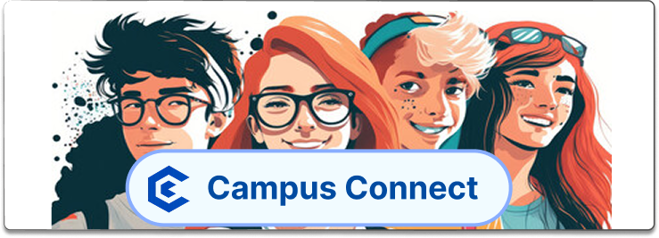

<p align="center">
  
</p>


**CampusConnect** is a comprehensive event management and campus engagement platform designed to bridge the gap between students, organizers, and administrators. It provides a seamless experience for discovering events, managing registrations, and fostering a vibrant campus community.

---

## 🚀 Problem Statement

Campus event information is often scattered across WhatsApp groups, notice boards, and emails. Students miss opportunities due to lack of awareness, while organizers struggle with visibility and participant management.

---

## 💡 Solution

Campus Connect provides a unified platform where:

- **Organizers** can create and manage events effortlessly.
- **Admins** verify and approve submissions to maintain quality.
- **Students** discover and register for events seamlessly.
- **Real-time Reminders** and notifications keep everyone synchronized.

---

## 🚀 Key Features

### 🎓 For Students

- **Event Discovery:** Browse and search for a wide range of campus events.
- **Easy Registration:** Register for events with just a few clicks.
- **Personal Dashboard:** Track your registrations, certificates, and upcoming schedules.
- **Real-time Notifications:** Stay updated with instant alerts for new events and updates.
- **Feedback & Certificates:** Provide feedback on attended events and download participation certificates.

### 🎭 For Organizers

- **Event Management:** Create, edit, and manage event details and logistics.
- **Participant Tracking:** Monitor registrations and manage attendee lists in real-time.
- **Dashboard Analytics:** Gain insights into event performance and engagement.
- **Automated Communication:** Send updates directly to registered participants.

### 🛡️ For Administrators

- **Content Moderation:** Review and approve/reject event proposals to ensure quality.
- **Organizer Oversight:** Manage organizer profiles and permissions.
- **Platform Analytics:** Overview of all activity across the campus ecosystem.

---

## ✨ Smart Event Tools

- **Calendar View:** Visual overview of all your registered events.
- **Event Highlights:** Never miss out with upcoming event spotlights.
- **Agenda Timeline:** Stay organized with a structured timeline of your day.
- **Activity Tracking:** Monitor your engagement and participation history.

---

## 🌍 Multilingual Support

Integrated localization using **Lingo.dev** to provide a seamless experience across languages:

- **Event Descriptions:** Automatically translated event details.
- **UI Content:** Fully localized interface elements.
- **Notifications:** Multi-language alert system.
- **Scalable i18n:** Built for global accessibility.

---

## � Google Calendar Integration

Students can add event reminders directly to **Google Calendar** from the event detail page via pre-filled scheduling links, ensuring they never miss a session.

---

## 🧪 Future Enhancements

- **Certificate Generation:** Automated PDF certificates for event participants.
- **Attendance Tracking:** Digital check-in system for event organizers.
- **Reminders:** Integrated Email & WhatsApp notification service.
- **Venue Booking:** Streamlined system for campus space management.
- **AI Recommendations:** Intelligent event suggestions based on student interests.

---

## �🛠️ Technology Stack

| Layer         | Technologies                                           |
| ------------- | ------------------------------------------------------ |
| **Frontend**  | React, Vite, Tailwind CSS, Framer Motion, Lucide Icons |
| **Backend**   | Node.js, Express                                       |
| **Database**  | MongoDB with Mongoose ODM                              |
| **Real-time** | Socket.io                                              |
| **Auth**      | JWT (JSON Web Tokens), Google OAuth                    |
| **i18n**      | Multi-language support                                 |

---

## 🏗️ Project Structure

```bash
CampusConnect/
├── backend/            # Express.js Server
│   ├── src/
│   │   ├── controllers/ # Request handlers
│   │   ├── models/      # MongoDB Schemas
│   │   ├── routes/      # API endpoints
│   │   └── middleware/  # Auth & Security
├── frontend/           # React + Vite Client
│   ├── src/
│   │   ├── components/  # Reusable UI elements
│   │   ├── pages/       # Page components
│   │   └── routes/      # Frontend routing
│   └── public/          # Static assets
```

---

## ⚙️ Getting Started

### Prerequisites

- Node.js (v16+)
- MongoDB (Local or Atlas)
- npm or yarn

### Installation

1. **Clone the repository:**

   ```bash
   git clone <repository-url>
   cd CampusConnect
   ```

2. **Setup Backend:**

   ```bash
   cd backend
   npm install
   # Create a .env file based on .env.example
   npm run dev
   ```

3. **Setup Frontend:**
   ```bash
   cd ../frontend
   npm install
   # Create a .env file based on .env.example
   npm run dev
   ```

---

## ⭐ Acknowledgment

Special thanks to open-source tools and localization platforms like **Lingo.dev** for enabling multilingual accessibility in campus ecosystems.

---

## 📄 License

This project is built for educational and hackathon purposes.

---

Built by [Keshav Chauhan](https://keshavchauhan.in)
